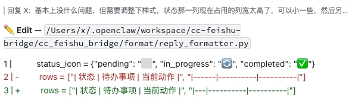
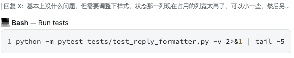
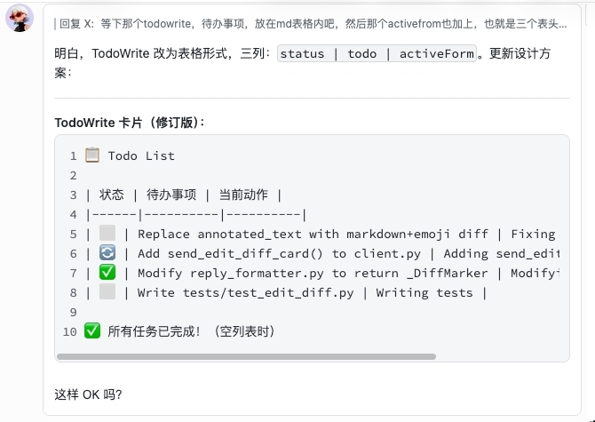

# cc-feishu-bridge

Claude Code 飞书桥接插件 — 在飞书中与本地 Claude Code 对话。

## 命令

- `/new` — 创建新会话
- `/status` — 查看当前会话状态（会话 ID、消息数、累计费用、工作目录）
- `/stop` — 打断 Claude 当前正在执行的查询
- `/git` — 显示当前项目 git status 和最近 5 次提交（工作区干净时也显示提交历史）
- `/switch <目录>` — 切换到另一个项目的 bridge 实例
- `/restart` — 重启当前 bridge 实例
- `/update` — 检查 PyPI 最新版本，如有更新则自动下载并重启
- `/memory` — 管理本地记忆库（list / add / search / delete / clear）
- `/help` — 查看所有可用命令

## 记忆系统

cc-feishu-bridge 内置本地记忆系统，让 Claude Code 记住曾经踩过的坑，不再重复犯错。

### 记忆类型

| 类型 | 说明 | 作用域 | 获取方式 |
|------|------|--------|----------|
| `problem_solution` | 踩过的坑 + 解决方案 | **全局共享** | CC 遇报错时自动通过 MCP 工具搜索 |
| `user_preference` | 用户偏好（如"用中文注释"） | **全局共享** | 每次对话自动注入 prompt |
| `project_context` | 项目背景知识 | 项目隔离 | 每次对话自动注入 prompt |

### 工作原理

1. **CC 遇到报错** → 自动通过 MCP 工具 `MemorySearch` 搜索本地记忆库
2. **命中已知问题** → 直接给出解决方案，不再重复调查
3. **成功解决问题** → 自动提取错误+解决方案写入记忆库，下次直接命中
4. **CC 也可主动调用** `MemoryList` / `MemoryAdd` / `MemoryDelete` / `MemoryClear` 管理记忆

### 手动管理

```bash
# 搜索记忆
cc-feishu-bridge memory search npm install failed

# 查看所有记忆
cc-feishu-bridge memory list

# 手动添加记忆（默认类型为 user_preference）
cc-feishu-bridge memory add "用 pnpm install，不要用 npm"

# 手动添加问题解决记录
cc-feishu-bridge memory add "pip install 报错" --type problem_solution --problem "openssl 版本不兼容"

# 删除记忆
cc-feishu-bridge memory delete <id>
```

飞书端也支持：`/memory list`、`/memory add xxx`、`/memory search xxx`、`/memory delete <id>`

### 数据存储

- 记忆库位置：`~/.cc-feishu-bridge/memories.db`
- 搜索命中次数越高的记忆排名越靠前

## 核心功能

- **工作目录即 Claude 的工作目录** — 在哪个目录下启动，就在哪个目录下工作；支持多开实例
- **消息队列** — 所有消息串行处理，不会出现并发冲突
- **引用回复** — Claude 的每条回复作为引用回复发出，对话结构清晰
- **引用消息感知** — 引用某条消息发送时，Claude 能感知原文
- **实时流式推送** — Claude 生成回复时实时推送，工具调用立即 flush，不重复发送
- **主动推送** — 当用户沉默超过阈值时，Claude 主动向用户推送工作进展通知
- **工具调用精美卡片** — Edit/Write 显示彩色 diff（行号 + 增删着色）；Bash 以代码段展示；Read 显示文件路径；TodoWrite 渲染为待办表格；Git Status 展示状态和最近提交

## 截图展示

### Edit / Write 彩色 Diff



### Bash 工具



### Git Status


### TodoWrite 待办列表


### 日常对话



## 快速开始

### 方式一：pip 安装（推荐）

```bash
pip install -U cc-feishu-bridge
cc-feishu-bridge
```

### 方式二：源码安装

```bash
git clone https://github.com/Hu1J/cc-feishu-bridge.git
cd cc-feishu-bridge
pip install -e .
cc-feishu-bridge
```

## 安装配置

首次运行 `cc-feishu-bridge` 时会自动进入安装流程，按提示操作即可（飞书扫码授权 → 创建机器人）。

配置文件位于 `.cc-feishu-bridge/config.yaml`（相对于启动目录）。

### 手动配置

如果需要手动配置，复制 `config.example.yaml` 为 `.cc-feishu-bridge/config.yaml`（相对于启动目录）：

```yaml
feishu:
  app_id: cli_xxx          # 飞书应用 App ID
  app_secret: xxx          # 飞书应用 App Secret
  bot_name: Claude

auth:
  allowed_users:            # 允许使用机器人的用户 open_id 列表
    - ou_xxx

claude:
  cli_path: claude          # claude CLI 路径
  max_turns: 50             # 最大对话轮数
  approved_directory: /path/to/workdir  # Claude 工作目录

storage:
  db_path: .cc-feishu-bridge/sessions.db
```

## 多开实例

在不同目录下启动 `cc-feishu-bridge`，即可同时运行多个机器人实例，每个实例有独立的工作目录和配置文件：

```bash
cd /path/to-project-A && cc-feishu-bridge  # 机器人 A 在 /path/to/project-A 下工作
cd /path/to-project-B && cc-feishu-bridge  # 机器人 B 在 /path/to/project-B 下工作
```

## 项目切换

在飞书消息中发送 `/switch <目标目录>` 即可在不停机的情况下将消息流切换到另一个项目：

- 停止当前 bridge（飞书连接断开）
- 将 config.yaml 拷贝至目标目录（`storage.db_path` 和 `claude.approved_directory` 自动重写为目标路径）
- 在目标目录启动 bridge
- 停止旧 bridge

切换完成后飞书机器人自动连接新项目，可继续对话。

## 安全说明

`cc-feishu-bridge` 以 **bypassPermissions 模式**运行，Claude Code 可执行任意终端命令、读写本地文件，无需每次授权确认。请仅在可信任的网络环境下使用。

## 获取帮助

如有问题请提交 [Issue](https://github.com/Hu1J/cc-feishu-bridge/issues)。

## 更新日志

详见 [CHANGELOG.md](./CHANGELOG.md)。
